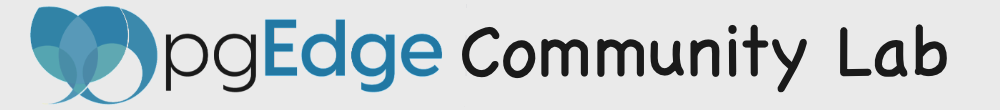

We build our enterprise-class, secure and multi-platform binaries on Rocky Linux 8 & 9 for *x86_64*; and on Rocky Linux 9 for *arm64*.   Our binaries run nicely on bare metal, vm's, containers or a localhost sandbox on your laptop.  In addition to EL8 & EL9; we are also tested to run on Ubuntu 22.04, SLES-15 & AWS Linux 2023.

# To install our Latest CLI:

```
python3 -c "$(curl -fsSL https://pgedge-upstream.s3.amazonaws.com/REPO/install.py)"
```

[Useful Notes](#useful-notes)<br>
[Usage Samples](#usage-samples)<br>
[CLI Documentation](https://github.com/pgedge/nodectl/blob/REL24_STABLE/cli/README.md)

# Useful Notes:
- Interested in our [CHANGELOG](https://github.com/pgEdge/nodectl/blob/REL24_STABLE/CHANGELOG.md)

- Install as a non-root user from your `$HOME` directory

- configure [password-less sudo](http://lussier.io/index.php/2023/04/07/passwordless-sudo/) for easier testing of advanced commands

- set up [password-less ssh to localhost](http://lussier.io/index.php/2023/06/07/passwordless-ssh-to-localhost-2) for using `cluster local-create` commands

- Tested with Python 3.9+ 
  - Python 3.9 on EL8, EL9, SLE-15, & AWS Linux 2023 (on EL8 & SLES-15 you must install python39)
  - Python 3.10 on Ubuntu 22.04
  - Python 3.12 on Fedora 39 & OSX

- Learn about running [pgEdge Platform](https://www.pgedge.com/products/pgedge-platform) in production and/or for professional grade support

- Denis' [Linux Cheatsheet](https://blog.pgedge.org)

- pgedge [Community License](https://www.pgedge.com/communitylicense>pgEdge Community License 1.0)


# Usage Samples:

Sandbox with latest *Postgres 16*, *Spock* & *Snowflake* installed into default *postgres* db<br>
```
./ctl install pg16 --start : install spock : install snowflake
```

Create db *db1* owned by *denis* installing & configuring *pgedge* core components (*Spock* & *Snowflake*) into *pg16*

```
./ctl install pgedge -U denis -P secret -d db1 --pg 16
```

If you first [shut off SE-Linux](http://lussier.io/index.php/2023/04/07/passwordless-sudo/), you can install & run pgEdge in AutoStart mode (using systemd) on a VM or Metal

```
./ctl install pgedge -U denis -P secret -d dbauto --pg 15 --autostart
```


Create a cluster *cl1* on localhost with two nodes, then install *northwind sample app* on *cl1* cluster

```
./ctl cluster local-create cl1 2 : cluster app-install cl1 northwind
```

Create cluster *clc* in docker compose with three nodes (**Coming Soon!**)
```
./ctl cluster container-create clc 3 : cluster app-install clc pgbench
```

Authenticate with pgEdge Cloud credentials, then list your clusters
```
./ctl secure login : secure cluster-list
```

Create virtual machine *n1* on AWS in Northern Virgina (iad) and *n2* VM on EquinixMetal in Portland (pdx)
```
./ctl multicloud node-create aws iad n1 : multicloud node-create eqn pdx n2
```

Create a JSON file for defining a hybrid multicloud cluster *my-cluster* with two nodes *n1* & *n2* created above (**Coming Soon!**)
```
./ctl multicloud cluster-define my-cluster "aws:iad:n1" "eqn:pdx:n2"
```
